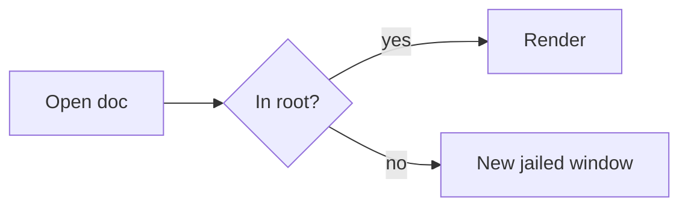

# Authoring visuals for sentinel-markdown

sentinel-markdown is a **folder-confined reader of untrusted Markdown**: it sanitizes all output,
runs **no scripts**, enforces a strict CSP (`script-src 'self'`, no `eval`), and makes **no network
requests** in the render path. So build every visual from the declarative primitives below — never
from HTML/JS widgets (Chart.js, D3, `<canvas>`, `<script>`, `onclick`, iframes), which are stripped.

## What renders

- **GFM Markdown**: headings (with stable anchor ids → outline + `[x](#heading)` links), **bold**/
  *italic*, lists, **task lists** (`- [ ]` / `- [x]`), blockquotes, rules, links, footnotes,
  strikethrough, and **tables with column alignment**.
- **Relative links** between docs (`./other.md`, `../dir/x.md`) navigate within the folder; a
  `#heading` suffix scrolls to that heading.
- **Wiki-links** for intra-folder cross-references: `[[Name]]`, `[[Name|Label]]`, `[[Name#Heading]]`,
  `[[path/to/Name]]` — resolve to a folder doc and navigate like a relative link (an unresolved
  target renders as an inert styled span). A **Backlinks** panel lists docs referencing the open one.
- **YAML front-matter** (flat `key: value`) at the very top; `title:` shows as a header.
- **Math (KaTeX)**: use double-dollar `$$E = mc^2$$` for both inline and display. A single `$` is
  a literal dollar sign (currency like `$100` is safe and won't be parsed as math).
- **Syntax-highlighted code**: fenced with a language tag (```ts, ```python, …).
- **Data fences**: fenced blocks labelled `json` / `yaml` / `toml` render in the data viewer
  with a **Pretty <-> Raw** toggle (JSON Lines needs the explicit `jsonl` label; it is never
  sniffed). Parsing is offline and non-executing.

## Diagrams — `mermaid` fence



Keep labels short; the diagram auto-adapts to light/dark theme.

Fit: the reading column is ~700px at default zoom; a wider diagram scrolls sideways.
Sequence diagrams: 3 lifelines or fewer fit without scrolling; keep messages and `note`
text short (a long note can overflow its box). Tall beats wide: prefer `flowchart TB`
when there are many nodes.

## Charts — `chart` (shorthand) or `vega-lite`

Data **must be inline** (no remote `data.url`).

`chart` compiles to Vega-Lite. Fields: `type` = `bar|line|area|point`; `data` = inline rows;
`x`,`y` = field name or `{ "field": "...", "type": "quantitative|nominal|ordinal|temporal" }`;
optional `series` (color) and `title`:

```chart
{ "type": "bar", "title": "FP per day",
  "data": [ {"day":"Mon","fp":28}, {"day":"Tue","fp":209}, {"day":"Wed","fp":49} ],
  "x": "day", "y": "fp" }
```

For richer charts (arc/pie, layered, faceted) use a full Vega-Lite v6 spec:

```vega-lite
{ "data": { "values": [ {"phase":"Docs","n":6}, {"phase":"AI","n":8} ] },
  "mark": {"type":"arc","tooltip":true},
  "encoding": { "theta": {"field":"n","type":"quantitative"},
                "color": {"field":"phase","type":"nominal"} } }
```

Sizing: the shorthand fits the reading column automatically. In `vega-lite`, prefer
`"width": "container"` (fits the column; text keeps its size). A NUMERIC width paints at
exactly that size and scrolls sideways in a narrow window -- it is never shrunk -- so use
one only when exact pixels matter.

## Images / SVG

- Reference **local** images with relative paths only: `` —
  `.svg/.png/.jpg/.gif/.webp`, inside the opened folder (no `..` escaping the root). Remote images
  are blocked.
- Inline `<svg>…</svg>` is allowed (sanitized): use theme-safe colors or `currentColor` (works in
  light + dark), and add `<title>`/`<desc>` for accessibility.

## Hard rules

- No `<script>`, `on*` handlers, `javascript:` URLs, `<iframe>/<object>/<embed>/<style>`, remote
  `<script src>`. No Chart.js/D3/canvas — use `chart`/`vega-lite`/`mermaid`.
- All data and assets local/inline; no network.
- Give images `alt` text; use a correct heading hierarchy.

## Formatting hygiene

- Plain Markdown — do **not** backslash-escape `#`, `-`, `*`, `[`, `]`.
- GFM tables: header, `|---|` separator, then rows on **consecutive** lines (a blank line between
  rows breaks the table). Don't double-space the document.

See [`references/AUTHORING-FOR-AI.md`](references/AUTHORING-FOR-AI.md) for the rationale behind these
boundaries and a paste-ready prompt block for tools that don't support skills.
