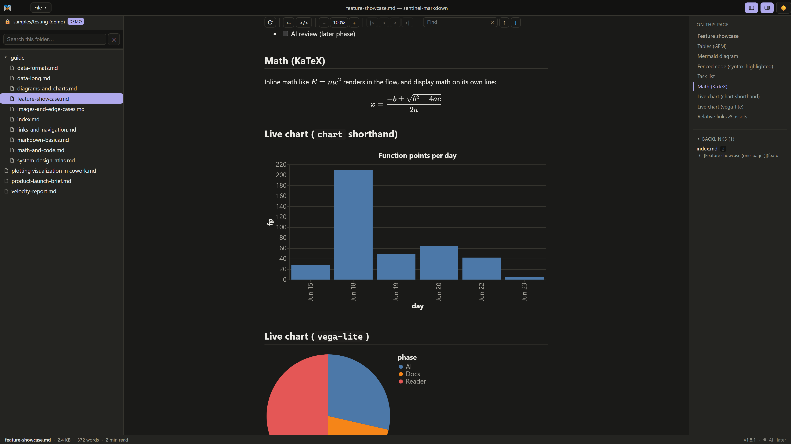
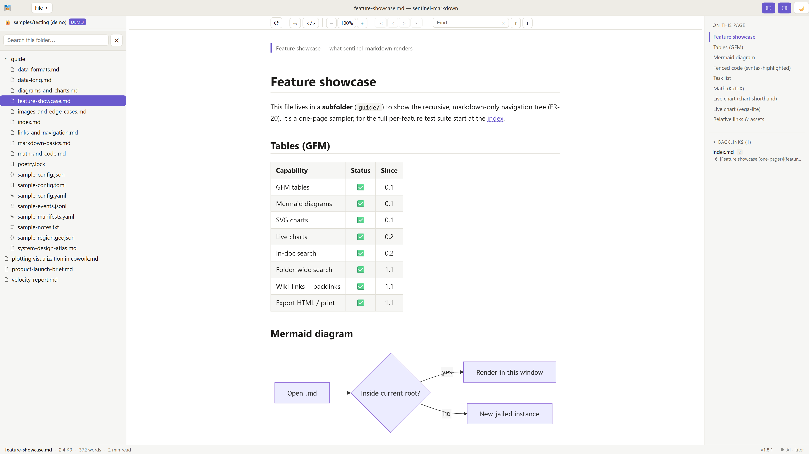
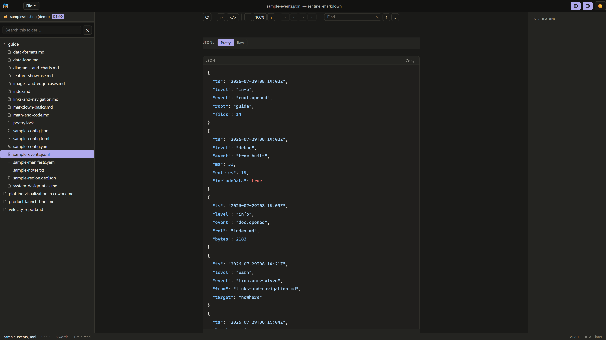
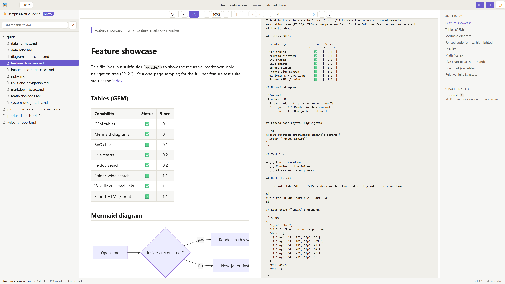
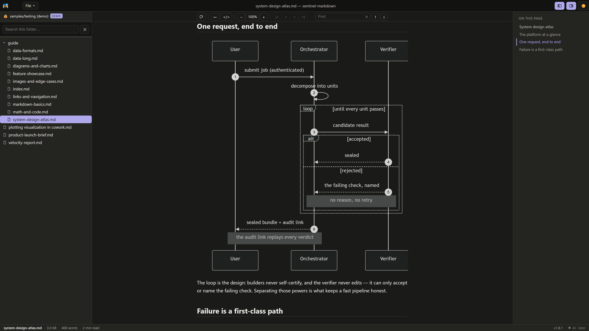
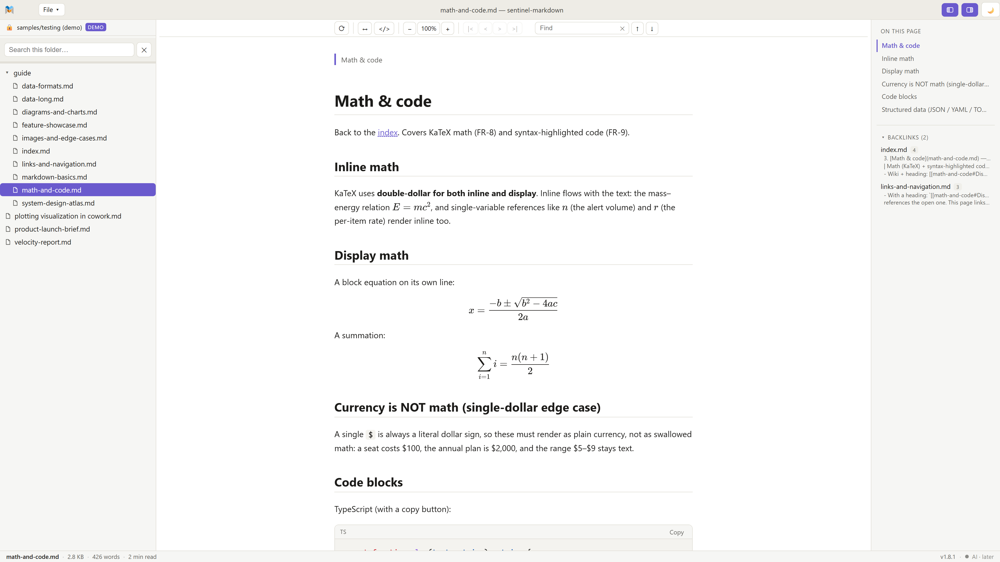

# Screenshots

The reader at work, both themes, 3840×2160. All content shown is from the app's bundled synthetic
sample folder.

## Rendered documents, dark theme

Live charts (the `chart` shorthand and Vega-Lite), KaTeX math, the document outline with
scroll-spy, and the backlinks panel.

## Reading view, light theme

GitHub-Flavored tables, a Mermaid flowchart, and the folder navigator with per-type file icons
(Markdown, JSON, JSON Lines, YAML, TOML, text).

## Data viewer

A JSONL log in the Pretty view — records indented and syntax-coloured, with the Raw bytes one
click away. The same viewer streams multi-gigabyte files from disk.

## Source ⟷ render split

The document and its Markdown source side by side, scroll-synced.

## Mermaid diagrams

A sequence diagram with loops, alternatives, and notes — from the bundled system-design sample,
which also carries a subgraphed flowchart and a state diagram.

## Math and code

Inline and display KaTeX, syntax-highlighted code with copy buttons, and the backlinks panel
showing which documents reference this one.

